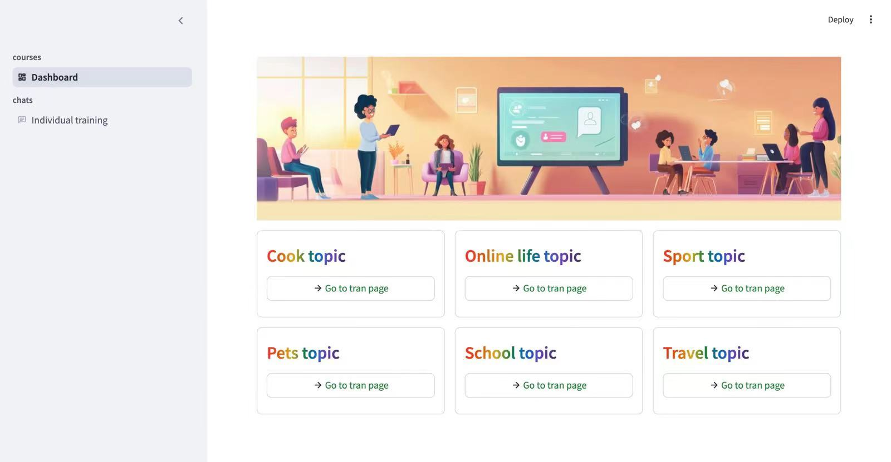

# AI IELTS Speaking SparkAI Competition Project

# Table of Contents

<!-- TOC -->

- [AI IELTS Speaking SparkAI Competition Project](#ai-ielts-speaking-sparkai-competition-project)
- [Table of Contents](#table-of-contents)
- [Overview](#overview)
- [Requirements](#requirements)
- [Usage](#usage)
    - [dashboard page](#dashboard-page)
    - [chat page](#chat-page)
    - [run the app](#run-the-app)

<!-- /TOC -->

# Overview

The project aims to develop an artificial intelligence model that can generate high-quality IELTS speaking test questions and answers. This project is based on the following steps:

1. Data collection: Collect a large dataset of IELTS speaking test questions and answers from various sources.
2. Data preprocessing: Preprocess the collected data to remove any irrelevant information and clean the data.
3. Data augmentation: Enhance the dataset by applying various techniques such as synonyms, definitions, and back translation to generate new questions and answers.
4. Model development: Develop a deep learning model that can generate high-quality IELTS speaking test questions and answers.
5. Model evaluation: Evaluate the performance of the developed model on the IELTS speaking test question and answer test set.
6. Model deployment: Deploy the developed model as a web application or mobile application for user use.

```
git clone https://github.com/LegendZDY/AI-IELTS-Speaking.git
```

# Requirements

1. Python 3.12+
2. Python modules:
   - streamlit
   - pyautogen
   - ipykernel
   - numpy
   - pydub
   - av
   - twilio
   - ffmpeg
   - spark_ai_python
   - streamlit_webrtc
   - streamlit-audiorecorder
   - streamlit-extras
   - websocket
   - websocket-client==1.8.0

# Usage

## dashboard page
<p align="center">
  
</p>

## chat page
<p align="center">
  
</p>

## run the app
```
streamlit run app.py
```